# The Last Prayer

<h2 style="color:#B95463; opacity:0.85;">
Content Warning
</h2>

This project contains horror elements, glitch visual effects, flashing imagery, and religious themes that some viewers may find unsettling.

## 1. Inspiration

 Our team will create an original pixel-art interactive artwork inspired by the visual atmosphere of The Starry Night, as well as psychological narrative games such as Needy Streamer Overload and Rusty Lake. 

 The protagonist is a nun who repeatedly faces two choices throughout the story: confronting the truth or choosing to lie. Each decision changes the visual and emotional state of the world. When she chooses to face the truth, the environment gradually becomes warmer and brighter. When she chooses to lie, the visuals begin to glitch, distort, and feel unstable. Through branching narratives and interactive mechanics, we aim to explore themes of escapism, self-deception, and emotional redemption.

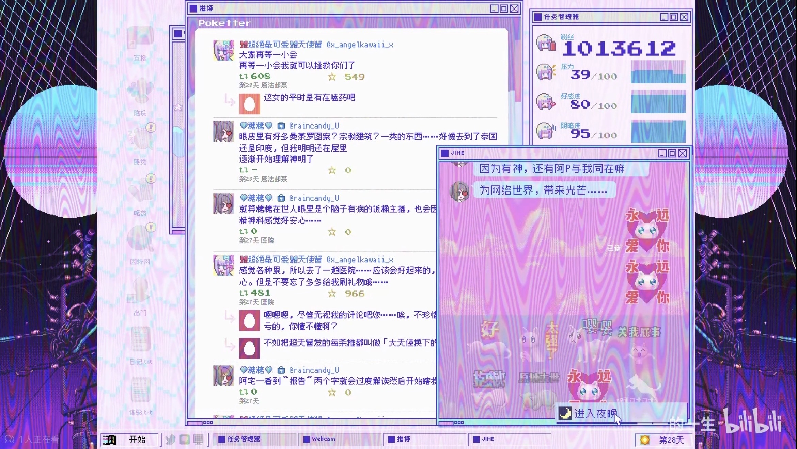
*Needy Streamer Overload*

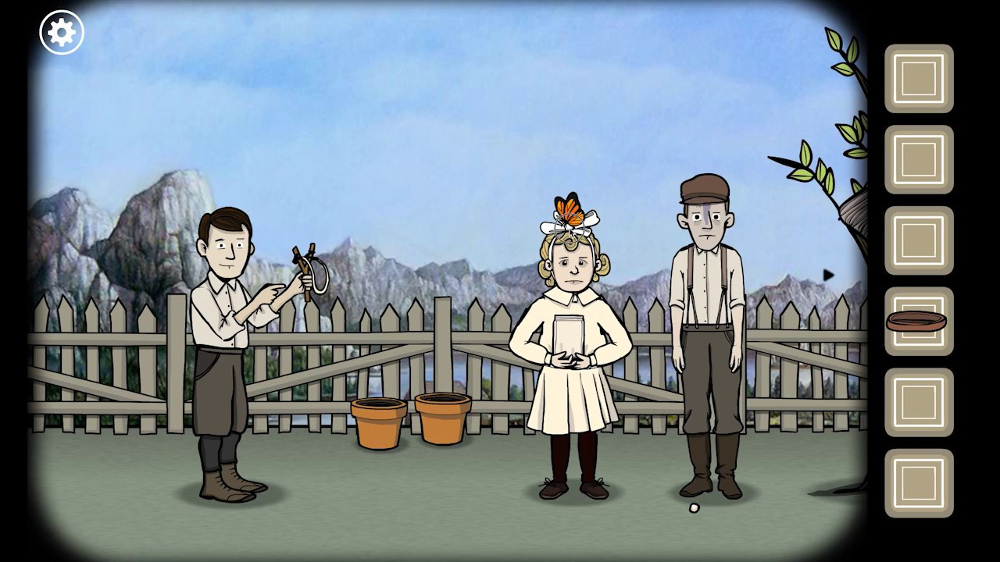
*Rusty Lake*

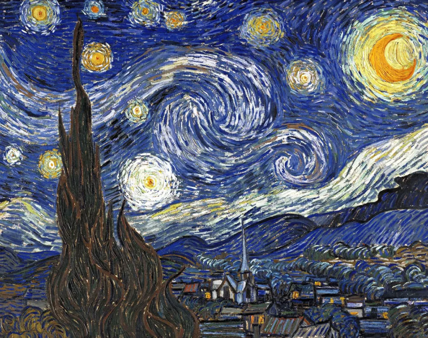
*The Starry Night*

## 2. Techniques

## 3. Mechanic ownership
### 3.1. Audio: Yusi Zhou
The audio mechanic uses the level and frequency content of an audio track to control the atmosphere and visual changes inside the confession room. This mechanic is created using p5.FFT analysis, allowing the soundtrack to directly influence the environment and emotional tone of the scene. 

The candle flame reacts to the volume of the audio. When the soundtrack becomes louder, the flame flickers more strongly, while the circular halo behind the candle expands. The soundtrack also affects the cross animation. Changes in audio volume cause the cross to pulse and flicker continuously, creating an unstable religious visual effect. High-frequency audio triggers sudden shaking movements in the cross, making it appear corrupted and disturbed. At the same time, sharp sounds generate frightening text flashes and grey-white glitch lines across the screen, producing a broken digital effect inspired by psychological horror and glitch aesthetics. In the heaven scene, the hearts and crosses float up and down based on the audio volume. Louder audio creates stronger floating movement, giving the ending a soft and sacred atmosphere connected to the music.

The user interacts with this mechanic through the story choices. If the nun chooses to face the truth, the audio remains calm and soft, keeping the visual effects stable and gentle. If she chooses to lie, the soundtrack gradually becomes heavier and more distorted, causing the candle, cross, glitch lines, and disturbing text effects to become increasingly unstable. This directly connects to our project vision by using sound-driven visual changes to represent guilt, self-deception, and psychological collapse.

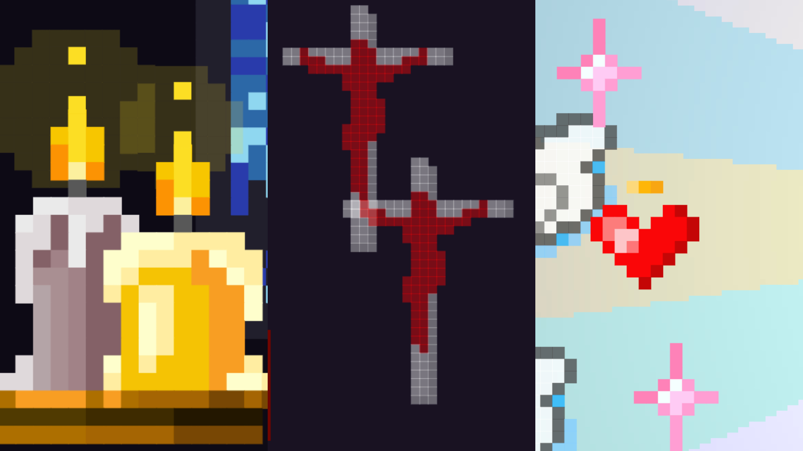
*Candle Flame Flickering, Cross Shifting, Hearts floating*

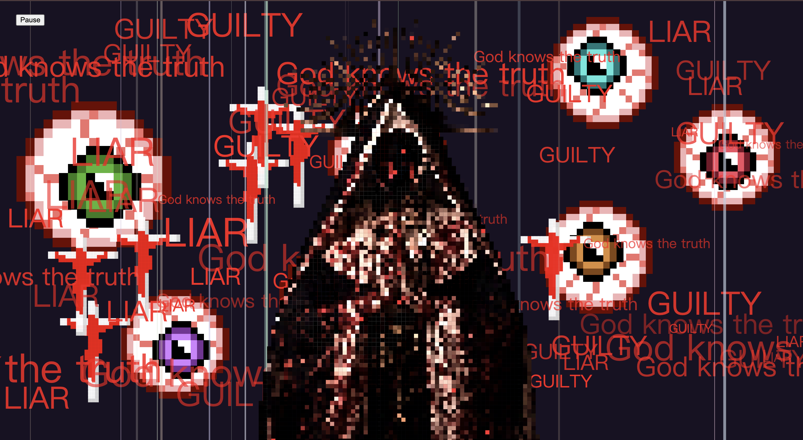
*Glitch Lines, Scary Texts*

### 3.2. Time-based: Zhige Hu
The time-based mechanic in our project is used to make the picture feel alive and emotionally reactive. We plan to use timers to gradually change the atmosphere depending on the player’s choices. Throughout the story, timed visual effects reflect the nun’s emotional state.

In the opening church scene, floating crosses gradually fade in, remain visible for a short period, fade out, and then reappear at new random positions. In the top-right corner of the window, a spider repeatedly moves up and down on its thread. These animations enhance the church's atmosphere, making the environment feel more immersive and visually engaging.

In the hell scene, each pupil randomly shifts to a new position every 40 frames, creating the effect that the eyes are constantly looking around. This makes the hell scene feel more unsettling and alive, as if the environment is watching the user. 

In the heaven scene, blue and yellow light rays rotate over time by updating the angle value every frame. And wings continuously fly from one side of the window to the other. These animations build a sense of spiritual elevation, creating a contrast with the darker scene of the project. 

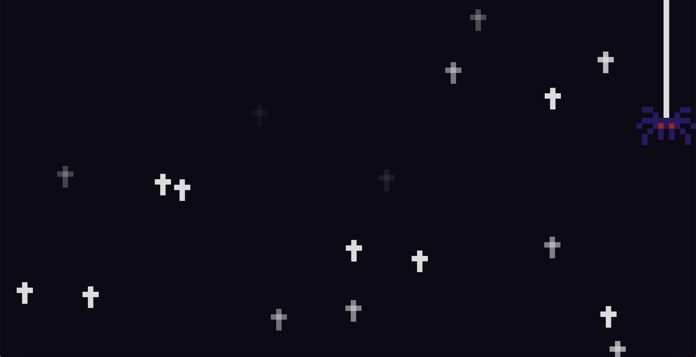
*Floating Crosses and Moving Spider*

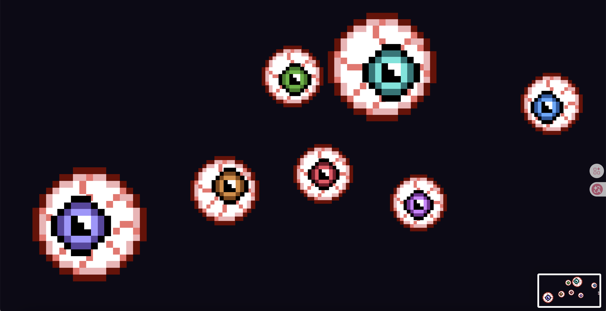
*Watching Eyes*

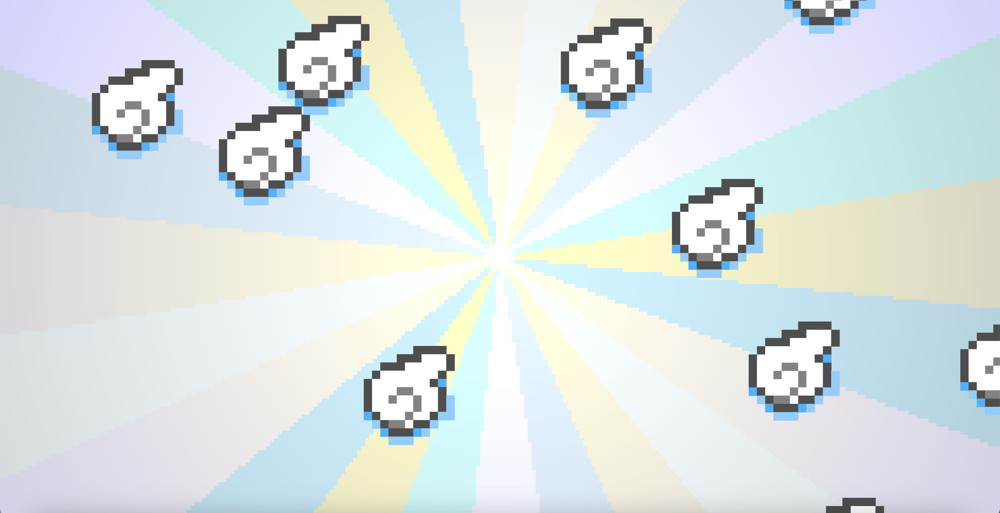
*Rotating Light Rays and Flying Wings*

### 3.3. Perlin noise and randomness: Wenjun Gu
The background is adorned with delicate floral patterns. While the player remains honest, the visuals employ a bright, warm color palette to cultivate a sacred and tranquil atmosphere. However, once the player chooses to "lie," the environmental tones instantly submerge into a somber combination of black and dark crimson, accompanied by a heavy "Glitch Art" effect characterized by shattering rectangular artifacts. The underlying Perlin noise transitions from a soft warm white into flowing dark red particles.Additionally, Perlin noise can simulate the dynamic movement of smoke and airflow when a candle is extinguished, while interacting with environmental parameters to generate smooth and natural visual effects, thereby enhancing the realism and immersion of the animation. This stark visual contrast intuitively manifests the collapse and distortion of the nun’s psyche, echoing the spiritual alienation brought by self-deception and immersing the player in a profound psychological horror experience.

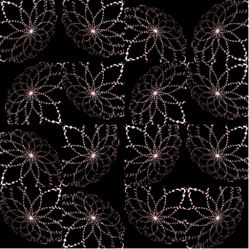

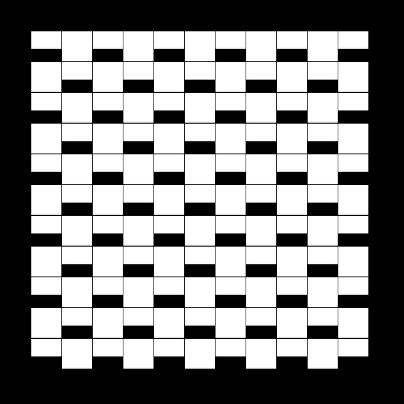

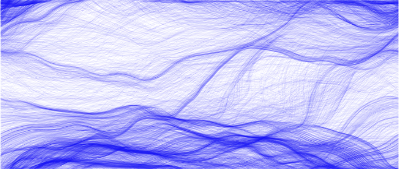

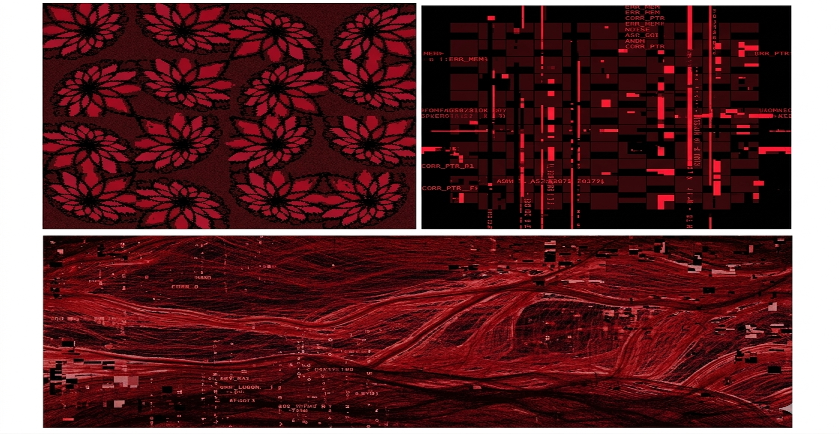

### 3.4. User input: Yang Zhou
The User Input mechanic allows players to directly influence the development of the story through keyboard and mouse interactions. 

During key moments in the narrative, the player must make choices for the nun: whether to confront the truth or lie to escape reality. These decisions are made by clicking dialogue options or pressing assigned keys on the keyboard. Each choice immediately changes the visual atmosphere of the game. When the player chooses to face the truth, the environment gradually becomes warmer and brighter, with calmer movement and visuals. When the player chooses to lie, the screen begins to show glitches, distortion, and unstable visual effects. 

During these visual transformations, players can also interact with the glitch effects through mouse movement, causing distorted areas to spread, shake, or briefly return to normal. This allows players to participate more directly in the changing state of the world. The mechanic ensures that players are not simply watching the nun’s psychological struggle, but actively participating in the transformation of her emotions and fate. Through interaction, players can experience how their choices gradually reshape the world, reinforcing the project’s themes of self-deception, guilt, and emotional consequences.

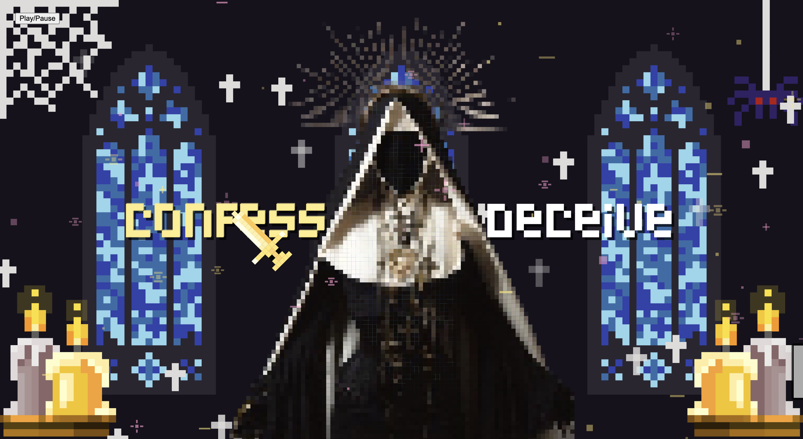

## 4. AI acknowledgement
ChatGPT was used to assist with specific coding tasks in this project. It helped calculate the pixel grid size so that visual elements could keep the same scale across different screen sizes and scenes. It was also used to help generate mirrored pixel images, such as candles or decorative objects, so the left and right sides of the scene could match visually. In addition, ChatGPT mainly helped with position calculations for visual elements, including calculating symmetrical positions, spacing between objects, and responsive placement based on the canvas size. This helped visual elements stay aligned and balanced across different scenes.

All AI-assisted code was reviewed, tested, and modified by the group members before being included in the final project. The code was adjusted to fit our visual design, scene layout, and p5.js project structure.

## 5. Interaction instructions
- Click the **Play/Pause** button to start the audio.
- Move the mouse across the screen to make a choice.
- Hover over **Confess** to charge the holy path and enter the **Heaven ending**.
- Hover over **Deceive** to charge the corrupted path and enter the **Hell ending**.
- Visual effects react to both the music and your choice.

