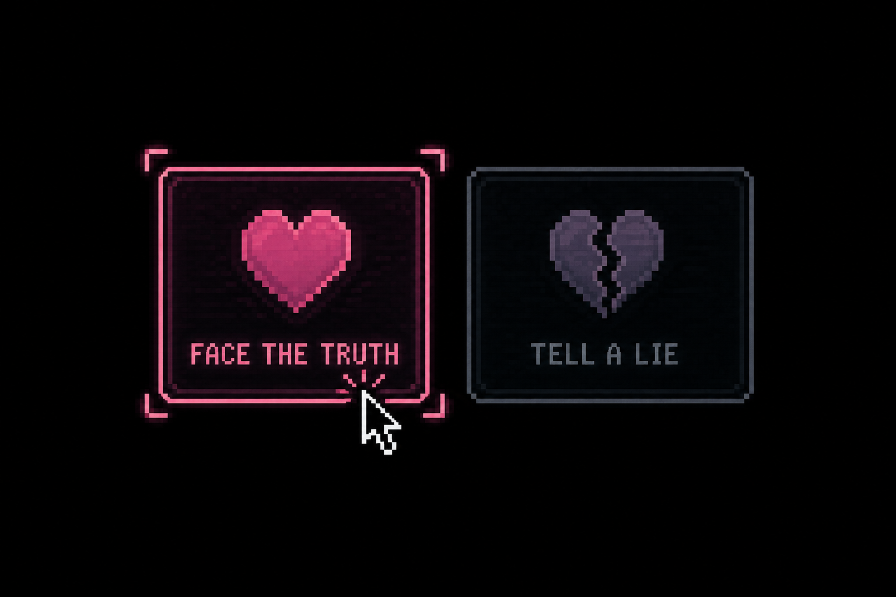
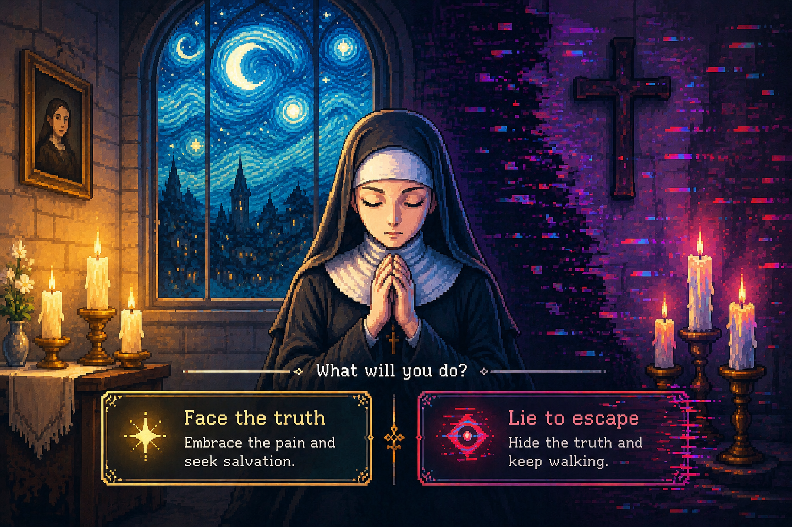
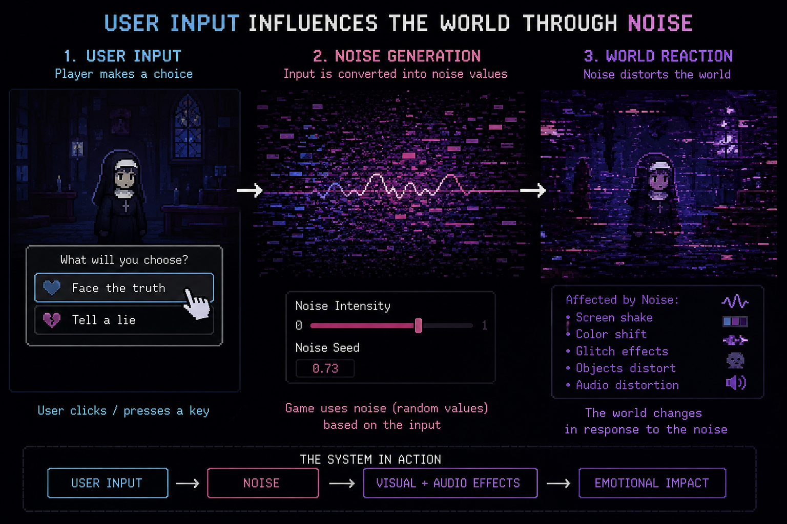

## Project TitleL：The Last Prayer

## Part 1: Project Direction

#### Our team will create an original pixel-art interactive artwork inspired by the visual atmosphere of The Starry Night, as well as psychological narrative games such as Needy Streamer Overload and Rusty Lake. 

#### The protagonist is a nun who repeatedly faces two choices throughout the story: confronting the truth or choosing to lie. Each decision changes the visual and emotional state of the world. When she chooses to face the truth, the environment gradually becomes warmer and brighter. When she chooses to lie, the visuals begin to glitch, distort, and feel unstable. Through branching narratives and interactive mechanics, we aim to explore themes of escapism, self-deception, and emotional redemption.

Needy Streamer Overload

Rusty Lake

The Starry Night

## Part 2: Mechanics
### Audio:
### Time-based:
### Perlin noise and randomness:
### User input: Yang Zhou
The User Input mechanic allows players to directly influence the development of the story through keyboard and mouse interactions. 

During key moments in the narrative, the player must make choices for the nun: whether to confront the truth or lie to escape reality. These decisions are made by clicking dialogue options or pressing assigned keys on the keyboard. Each choice immediately changes the visual atmosphere of the game. When the player chooses to face the truth, the environment gradually becomes warmer and brighter, with calmer movement and visuals. When the player chooses to lie, the screen begins to show glitches, distortion, and unstable visual effects. 

During these visual transformations, players can also interact with the glitch effects through mouse movement, causing distorted areas to spread, shake, or briefly return to normal. This allows players to participate more directly in the changing state of the world. The mechanic ensures that players are not simply watching the nun’s psychological struggle, but actively participating in the transformation of her emotions and fate. Through interaction, players can experience how their choices gradually reshape the world, reinforcing the project’s themes of self-deception, guilt, and emotional consequences.

## Part 3: Putting It Together

