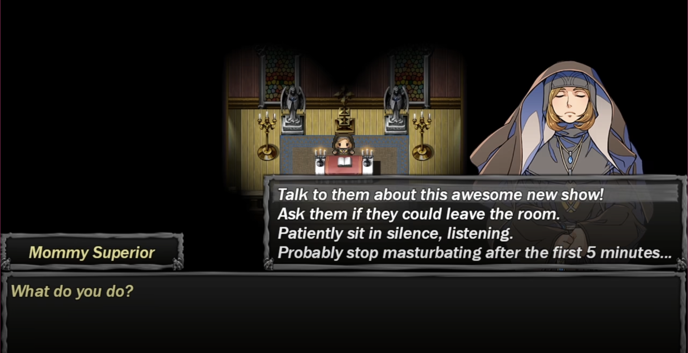
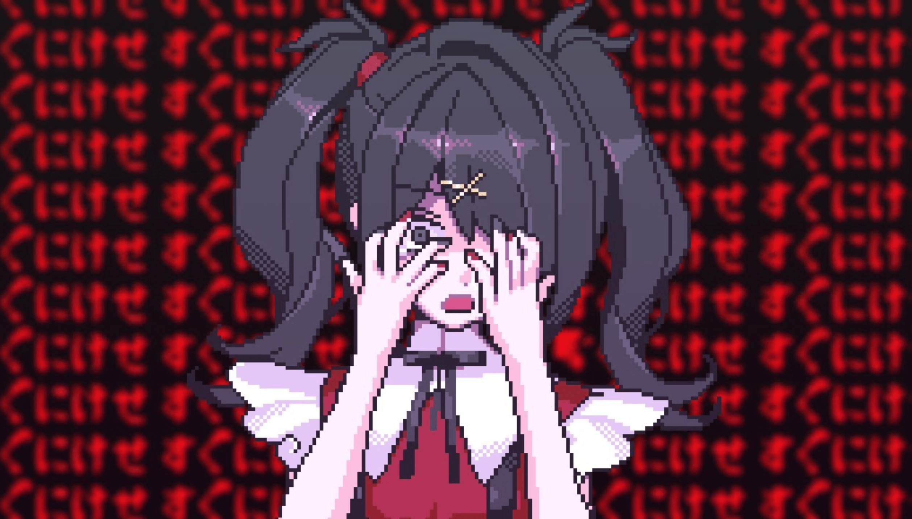
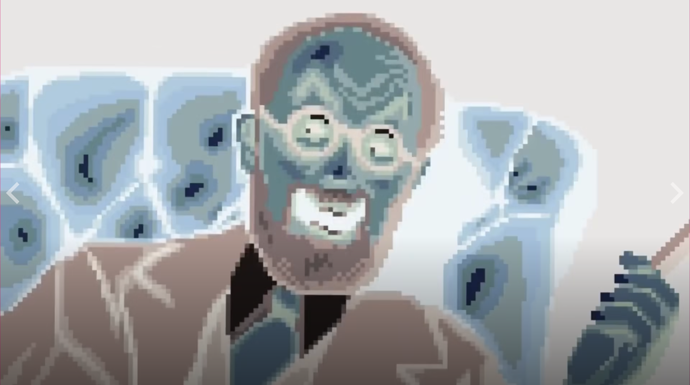
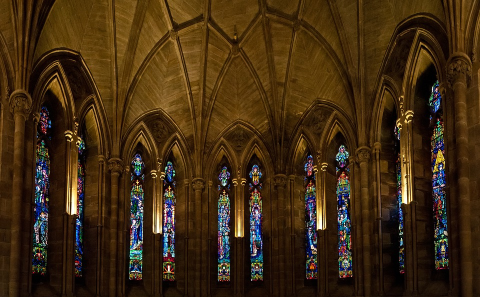
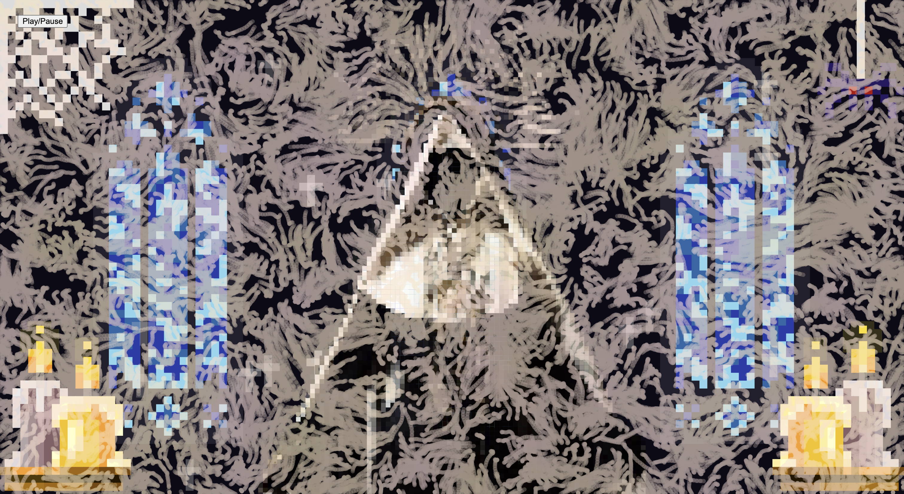
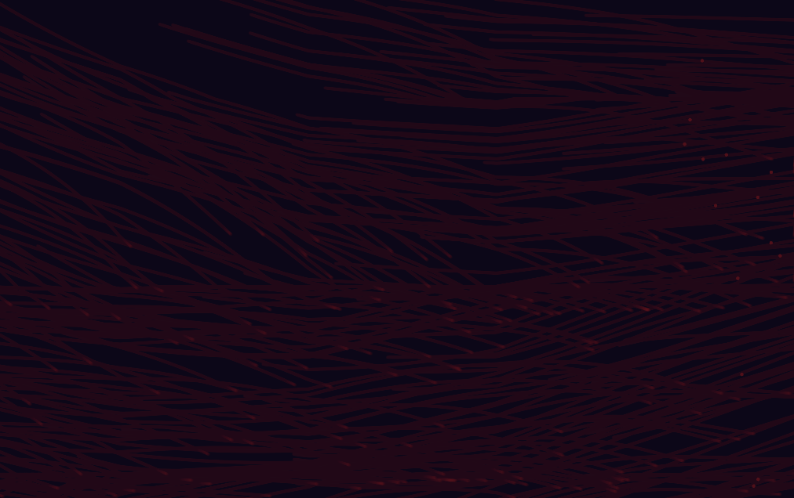
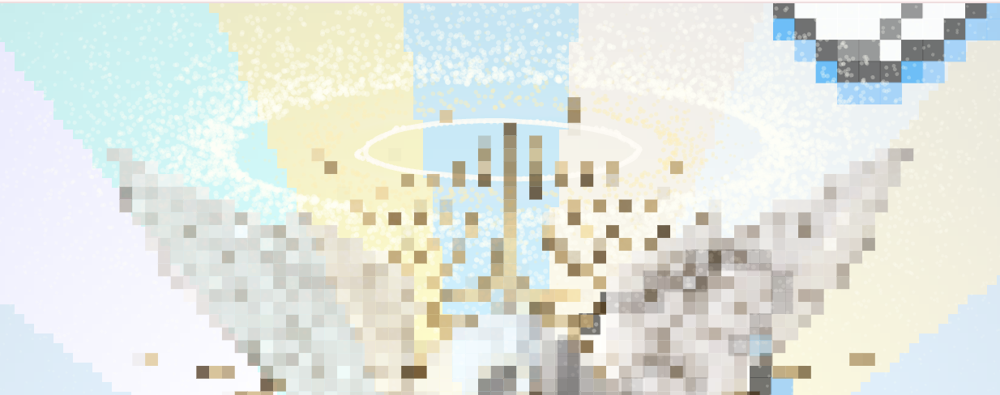
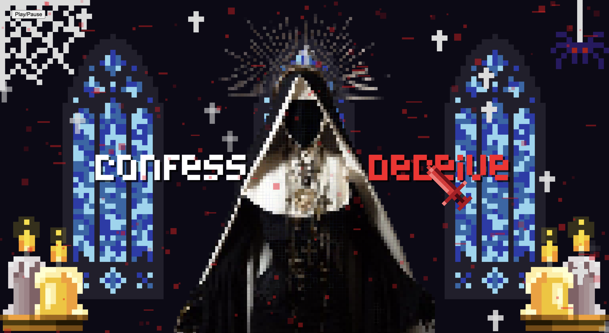

# The Last Prayer

<h2 style="color:#B95463; opacity:0.85;">
Content Warning
</h2>

This project contains horror elements, glitch visual effects, flashing imagery, and religious themes that some viewers may find unsettling.

## 1. Inspiration

Our team created an original pixel-art interactive artwork inspired by Gothic stained glass, and psychological narrative games such as Needy Girl Overdose and The Confession, and the horror aesthetics of The Creepy Syndrome. Needy Girl Overdose inspired the use of contrasting emotional states. Its strong pixel-art and glitch aesthetic also influenced our overall visual style. Meanwhile, The Creepy Syndrome influenced the project’s horror atmosphere, and The Confession inspired its exploration of confession and the consequences of one's choices.

Set within a confessional, the player chooses whether to tell the truth or tell a lie to a nun. This decision determines the path of the story. If the player chooses to deceive the nun, the world will gradually begin to deteriorate, descending into a hellish place filled with horror, distortion, and unease. In contrast, choosing to confess and tell the truth will make the world become a heaven, allowing the soul to find peace and redemption. Through the combination of pixel-art visuals, religious imagery, and interactive storytelling, our work explores themes of confession, deception, and redemption.

*The Confession*

*Needy Girl Overdose*

*The Creepy Syndrome*

*Church Stained Glass*

## 2. Techniques
This project was developed using p5.js and p5.sound to create an interactive audio-reactive experience. The work combines mouse interaction, pixel-art graphics, procedural animation, and real-time audio analysis to support the narrative choice between Heaven and Hell.

Audio reactivity was implemented using p5.Amplitude and p5.FFT. Functions such as getLevel() and analyze() were used to retrieve volume and frequency data from the soundtrack. These values were then mapped to visual effects using functions including map(), sin(), and random(). Music data influenced candle halos, floating objects, cross animations, glitch effects, and environmental atmosphere throughout the experience.

The visual design was created using custom pixel-art assets built from two-dimensional arrays and colour palettes. Functions such as rect(), fill(), noStroke(), and nested for loops were used to draw pixel-based graphics. Responsive scaling was achieved through calculations based on windowWidth, windowHeight, and dynamic pixel sizing so that the project could adapt to different screen sizes.

Mouse interaction forms the core gameplay mechanic. The project uses variables linked to mouseX and mouseY to track player choices. Hovering over different options gradually charges either the holy or corrupted path, triggering visual feedback and eventually leading to different endings.

Procedural animation was implemented using functions such as random(), noise(), sin(), and lerp(). These techniques were used to create flickering crosses, floating particles, moving wings, breathing animations, and glitch effects. Scene transitions were first generated using noise()-based patterns, allowing textures such as spreading blood or organic shapes to gradually cover the screen. After this transition layer appeared, alpha overlays and changing transparency values were used to smoothly fade between scenes. Together, these techniques helped create two contrasting atmospheres: a sacred Heaven ending and a corrupted Hell ending.

## 3. Mechanic ownership
### 3.1. Audio: Yusi Zhou（@ariri0413-star）
The audio mechanic uses the level and frequency content of an audio track to control the atmosphere and visual changes inside the confession room. This mechanic is created using p5.Amplitude and p5.FFT analysis, allowing the soundtrack to directly influence the environment and emotional tone of the scene. 

The candle flame reacts to the volume of the audio. When the soundtrack becomes louder, the flame flickers more strongly, while the circular halo behind the candle expands. The soundtrack also affects the cross animation. Changes in audio volume cause the cross to pulse and flicker continuously, creating an unstable religious visual effect. High-frequency audio triggers sudden shaking movements in the cross, making it appear corrupted and disturbed. At the same time, sharp sounds generate frightening text flashes and grey-white glitch lines across the screen, producing a broken digital effect inspired by psychological horror and glitch aesthetics. In the heaven scene, the hearts and crosses float up and down based on the audio volume. Louder audio creates stronger floating movement, giving the ending a soft and sacred atmosphere connected to the music.

The user interacts with this mechanic through the story choices. If the nun chooses to face the truth, the audio remains calm and soft, keeping the visual effects stable and gentle. If she chooses to lie, the soundtrack gradually becomes heavier and more distorted, causing the cross, glitch lines, and disturbing text effects to become increasingly unstable. This directly connects to our project vision by using sound-driven visual changes to represent guilt, self-deception, and psychological collapse.

*Candle Flame Flickering, Cross Shifting, Hearts floating*

*Glitch Lines, Scary Texts*

### 3.2. Time-based: Zhige Hu (@zhigehu)
The time-based mechanic in our project is used to make the picture feel alive and emotionally reactive. We plan to use timers to gradually change the atmosphere depending on the player’s choices. Throughout the story, timed visual effects reflect the nun’s emotional state.

In the opening church scene, floating crosses gradually fade in, remain visible for a short period, fade out, and then reappear at new random positions. In the top-right corner of the window, a spider repeatedly moves up and down on its thread. These animations enhance the church's atmosphere, making the environment feel more immersive and visually engaging.

In the hell scene, randomly positioned, sized, and coloured eyes are generated across the screen, and their pupils randomly shifts to a new position every 40 frames, creating the effect that the eyes are constantly looking around. This makes the hell scene feel more unsettling and alive, as if the environment is watching the user.

In the heaven scene, blue and yellow light rays rotate over time by updating the angle value every frame. And wings with random starting positions continuously fly from one side of the window to the other. These animations build a sense of spiritual elevation, creating a contrast with the darker scene of the project. 

*Floating Crosses and Moving Spider*

*Watching Eyes*

*Rotating Light Rays and Flying Wings*

### 3.3. Perlin noise and randomness: Wenjun Gu (@wenjungu0109)
Perlin noise and randomness are used to create atmospheric visual effects across scene transitions and ending environments. During the transition into the Heaven ending, Perlin noise generates floating sacred symbols and decorative pattern effects that gradually appear as the scene loads, creating a smooth and divine transformation. In the Heaven scene, Perlin noise is applied to the angelic halo effect, producing gentle breathing-like movement and subtle variations in light that reinforce the peaceful and sacred atmosphere.

In contrast, the Hell ending uses Perlin noise to generate spreading blood mist particles that gradually disperse across the screen. The organic and unpredictable movement created by the noise function gives the mist a natural flow, enhancing the unsettling mood of the scene. By combining controlled randomness with smooth procedural motion, these effects help distinguish the emotional tone of each ending while maintaining visual continuity throughout the experience.

*Transition: to heaven*

*Blood Mist*

*Angle Halo*

### 3.4. User input: Yang Zhou (@Yang-Zhou-123)
The User Input mechanic allows players to interact with the choice system through mouse interaction. Instead of using traditional buttons, the cursor is transformed into a sword that visually reflects the player’s choice. When hovering over the “Confess” option, the sword gradually changes from white to gold, while the text of the option also shifts from white to yellow to indicate the charging progress. Similarly, hovering over the “Deceive” option causes the sword to transition from white to red, and the text gradually changes from white to red as the charge builds up. These charging animations provide immediate visual feedback and encourage deliberate decision-making.

As the sword charges, the environment begins to react to the player’s choice. Once the Confess option is fully charged, sacred symbols emerge and float across the screen, reinforcing the theme of redemption and spiritual salvation. In contrast, fully charging the Deceive option triggers random noise particles and glitch animations, creating a corrupted and unstable visual atmosphere. These effects transform a simple choice into an interactive visual experience, allowing players to actively participate in shaping the emotional direction of the story and highlighting the contrast between confession and avoidance.

*User Option: Confess*

*User Option: Deceive*
## 4. AI acknowledgement
ChatGPT and Claude were used to assist with specific coding tasks during this project. AI support was mainly used for mathematical calculations, responsive layout formulas, and small programming suggestions within p5.js.

This included calculating pixel grid sizes so that visual elements could maintain a consistent scale across different screen sizes, generating mirrored pixel-art structures, and calculating symmetrical positions, spacing, and responsive placement of objects on the canvas. AI was also used to suggest formulas for some visual effects, such as wave-like motion. AI also provided examples of p5.js functions and loop structures.

All AI-assisted code was reviewed, tested, modified, and integrated by the group members before inclusion in the final project. The final implementation, visual design, scene composition, interaction design, and creative decisions were developed and refined by the project team.
## 5. External references
- The Coding Train. Flow Fields and Perlin Noise tutorials:
  https://thecodingtrain.com/challenges/24-perlin-noise-flow-field
- Ken Perlin's improved noise algorithm was used as a reference for the custom Perlin noise generator in the Hell ending：
https://mrl.cs.nyu.edu/~perlin/noise/
## 6. Interaction instructions
- Click the **Play** button to start the audio.
- Move the mouse across the screen to make a choice.
- Hover over **Confess** to charge the holy path and enter the **Heaven ending**.
- Hover over **Deceive** to charge the corrupted path and enter the **Hell ending**.
- Visual effects react to both the music and your choice.
- Some visual effects are triggered over time. Stay in each scene for a few moments to experience the full atmosphere.

